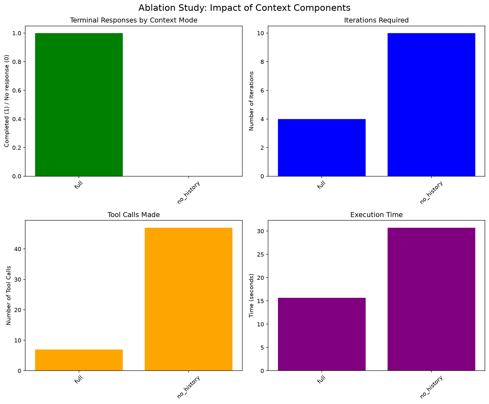

# 第 1 章学习笔记：Agent = LLM + 上下文 + 工具

> 学习日期：2026-09-16
>
> 对应正文：[《AI Agent 入门》](../book/chapter1.md)
>
> 本章实验总览：[chapter1/README.md](README.md) ｜ 验收台账：[EXPERIMENT_LEDGER.md](EXPERIMENT_LEDGER.md)

## 1. 本章学习目标

完成本章后，我应当能够：

1. 解释现代 Agent 为什么不只是一个大模型，而是 **LLM、上下文、工具与运行框架（Harness）** 的组合。
2. 画出并说明 `Action → Environment → Observation → Next Action` 的 ReAct 闭环。
3. 区分“模型输出了答案”“程序正常结束”“任务正确完成”“答案有证据支撑”这四件事。
4. 根据任务的不确定性，在确定性工作流和自主 Agent 之间做选择。
5. 用上下文消融、联网检索、代码执行和图像生成实验评价一个 Agent，而不是只凭最终文本判断效果。

---

## 2. 核心知识框架

### 2.1 现代 Agent 的组成

可以把一个 Agent 简化为：

```text
Agent = LLM（决策）+ Context（状态与观察）+ Tools（行动能力）+ Harness（运行与约束）
```

- **LLM 是大脑**：理解目标、拆解任务、选择下一步行动、整合结果。
- **上下文是眼睛和短期记忆**：让模型看见用户要求、历史行动、工具返回值和当前状态。
- **工具是手脚**：让模型能够搜索网页、读取 PDF、执行代码、调用业务系统或生成图片。
- **Harness 是运行框架**：负责消息拼装、工具协议、循环上限、错误重试、状态保存、护栏、日志和评估。

因此，模型能力很重要，但生产系统的可靠性往往取决于 Harness 是否把观察送对、把动作执行对、把失败记录清楚。

### 2.2 观察空间与动作空间

- **观察空间（Observation Space）**：Agent 当前能看到的信息，例如用户问题、网页搜索结果、PDF 内容、代码输出和历史消息。
- **动作空间（Action Space）**：Agent 当前被允许执行的动作，例如调用 `web_search`、运行 Python、读取文件或直接回答。

工具定义决定 Agent “能做什么”，工具结果决定 Agent “知道刚才发生了什么”。只有工具定义而没有工具结果，Agent 虽然可以行动，却是在盲目行动。

### 2.3 ReAct 闭环

```text
用户目标
   ↓
Reason / Thought：判断缺少什么信息
   ↓
Action：选择并调用工具
   ↓
Environment：外部系统执行动作
   ↓
Observation：把真实结果返回给模型
   ↓
继续推理、再次行动，或给出 Answer
```

ReAct 的关键不在于“调用过工具”，而在于工具结果确实进入下一轮决策。若 Observation 通道被切断，就没有形成可靠闭环。

### 2.4 工作流与自主 Agent

| 维度 | 工作流（Workflow） | 自主 Agent |
| --- | --- | --- |
| 路径 | 预先编排，步骤较固定 | 模型动态决定下一步 |
| 可控性 | 高，容易复现和审计 | 较低，需要循环上限与护栏 |
| 灵活性 | 适合规则明确的任务 | 适合开放式、多步骤研究 |
| 典型风险 | 固定节点丢失用户意图 | 搜索发散、重复调用、成本失控 |
| 适用场景 | 审批流、格式转换、固定内容生产 | 调研、诊断、探索性任务 |

实践中常用混合模式：用工作流固定边界和验收点，让模型只在局部步骤中自主决策。

---

## 3. 实验 1-1：上下文消融

### 3.1 实验问题

在同一个多币种财务任务中，分别移除历史记录、已保留的推理、工具定义或工具观察，比较 Agent 的行为变化。这个实验要回答的不是“哪个模型最强”，而是：**闭环中的不同上下文成分分别承担什么作用？**

实验包含五组：

- `full`：完整上下文。
- `no_history`：不保留先前行动历史。
- `no_reasoning`：不把上一轮推理继续带入历史，但模型每一轮仍可重新推理。
- `no_tool_calls`：不给模型工具定义。
- `no_tool_results`：真实执行工具，但不给模型有效观察结果。

### 3.2 规范运行结果

以下数据来自当前规范证据，而不是旧版演示报告：

| 实验组 | 迭代 | 工具动作 | 结果 | 解释 |
| --- | ---: | ---: | --- | --- |
| `full` | 3 | 4 | `correct` | 闭环完整，数值正确且有观察依据 |
| `no_history` | 5（到上限） | 15 | `no_terminal_response` | 忘记做过什么，出现重复调用 |
| `no_reasoning` | 3 | 4 | `correct` | 本次未观察到可测退化 |
| `no_tool_calls` | 1 | 0 | `no_unsupported_numbers` | 无法调用换算工具，未编造结果 |
| `no_tool_results` | 5（到上限） | 9 | `no_terminal_response` | 看不到结果，重复行动且无法收敛 |

规范运行总计使用 22,954 tokens，其中 15,104 为缓存提示 tokens。数据见[验收证据](context/validation/latest.json)。

### 3.3 我的结论

1. `full` 形成了完整的 `Action → Environment → Observation → Next Action` 闭环。
2. `no_tool_results` 保留 Action 和真实工具执行，却切断了 `Environment → LLM` 的 Observation 通道。此时工具在程序侧“运行成功”，不等于 Agent 利用到了结果。
3. `no_history` 说明历史记录承担去重和状态连续性功能；没有历史，Agent 容易把已经做过的步骤再次执行。
4. `no_reasoning` 在本次任务中仍然正确，不能写成“去掉推理必然退化”。该消融只移除了**历史中保留的推理**，并没有禁止模型在新一轮重新推理。当下一步几乎可由最新观察直接决定时，旧的“为什么”可能是可恢复的。
5. `no_tool_calls` 中“不发生工具调用”是由实验设置直接决定的，真正值得观察的是模型接下来选择拒答、解释限制，还是自行编造数字。

### 3.4 最重要的评价原则

```text
completed ≠ task_success ≠ grounded
```

- **completed**：循环产生了终止文本。
- **task_success**：最终答案通过任务专用的正确性规则。
- **grounded**：答案中的关键事实或数字能在模型实际收到的观察中找到依据。

一个 Agent 可以顺利终止并写出流畅答案，但数字来自模型自行假设的汇率。这种情况完成了文本生成，却没有可靠完成任务。生产系统必须同时检查正确性和证据归属。

### 3.5 附件与复现入口

- [实验说明](context/README.md)
- [规范实验入口](context/run_experiment_1_1.py)
- [完整验收证据 JSON](context/validation/latest.json)
- [消融报告](context/ablation_study_report.md)
- [实验结果图](context/ablation_study_results.png)
- [实验用财务 PDF](context/fixtures/pdfs/sample_financial_report_q1_2024.pdf)
- [groundedness 检查实现](context/grounding.py)



---

## 4. 实验 1-2：联网搜索 Agent

### 4.1 实现目标

本实验使用 **Kimi K3 + Moonshot Web Search** 构建联网研究 Agent。模型不是被固定程序逐条喂搜索词，而是根据问题自主判断信息缺口、生成查询、检查第一轮证据，再发起后续搜索并整合带来源的答案。

```text
问题 → 推理 → 生成搜索词 → web_search → 观察搜索结果
     → 判断证据缺口 → 后续搜索 → 整理权威来源 → 回答
```

规范运行围绕东盟成员资格、东帝汶入盟日期以及印度尼西亚首都法律状态展开，实际完成了 15 个成功且不同的搜索 fiber，多轮检索和最终答案均有记录；验收项包括模型身份、搜索轮次、来源链接、官方来源和检索日期等，全部通过。

### 4.2 学到的内容

- 联网能力的价值是弥补模型参数中的时间截止和知识缺口。
- 搜索次数多不代表研究质量高；关键是查询是否服务于明确的证据缺口。
- 最终答案需要区分事实、法律条件、当前状态和推断，不能只堆链接。
- 来源选择应优先采用政府、国际组织、法规原文、论文和官方文档；聚合站、社交媒体和转载只能作为线索。
- “有引用”不等于“引用支持结论”。每个关键结论都要能回指到相邻且真正相关的来源。

### 4.3 附件与复现入口

- [项目说明](web-search-agent/README.md)
- [实验入口](web-search-agent/run_experiment_1_2.py)
- [首次真实搜索记录](web-search-agent/first_real_search.json)
- [规范验收证据](web-search-agent/validation/latest.json)
- [Agent 循环实现](web-search-agent/agent.py)

---

## 5. 实验 1-3：搜索 + 代码执行的 Deep Research

### 5.1 为什么要把搜索与代码结合

搜索擅长找数据，代码擅长做可重复的计算。让模型直接心算大量组合、技术指标或统计量，既容易出错，也难以审计。更可靠的闭环是：

```text
澄清需求 → 多轮搜索数据 → 检查数据质量 → 生成代码
→ 沙箱执行 → 读取计算结果/错误 → 修正 → 带来源回答
```

### 5.2 验证结果

本实验采用多提供商验收策略：官方 OpenAI 路径被保留，但当时在推理前受到额度限制；等价的阿里云百炼 `qwen3.7-plus` 路径通过验收。这不应被描述为 OpenAI 模型失败，因为请求没有进入模型推理。

已验证的两类任务：

1. **东盟首都距离**：模型发出坐标检索，并用代码枚举 10 个首都的 45 个两两组合。沙箱结果中最短对为 Kuala Lumpur–Singapore，约 316.35 km；独立参考坐标计算为 309.3 km。差异提醒我：代码可以正确执行，但输入坐标口径仍会影响答案。
2. **比特币技术分析**：第一轮先澄清数据源和指标，不调用工具；续接后进行了 3 轮搜索和 4 次代码执行，计算 MA7、MA20、RSI14、MACD、区间收益与最大回撤，并在沙箱中生成图表。

### 5.3 研究质量反思

实验机制已经跑通，但 **Agent 工程成功不等于研究质量完美**。早期搜索结果混入 Scribd、Facebook、Pinterest、CSDN、知乎等来源，并把 Wikipedia 简单称为“最可靠来源”，这个判断过于草率。Wikipedia 的坐标可作为实用线索或交叉核验，但不应无条件替代官方地理数据或权威数据库。


此外，沙箱能够生成图片不代表宿主程序已经取得图片文件；本次 API 只返回日志，图表 PNG 仍留在远端沙箱。这是“工具执行成功”与“产物交付成功”的又一个区别。

### 5.4 附件与复现入口

- [项目说明](search-codegen/README.md)
- [规范实验入口](search-codegen/run_experiment_1_3.py)
- [规范验收证据](search-codegen/validation/latest.json)
- [首次搜索与代码执行记录](search-codegen/first_search_codegen.json)
- [Go 与 Python 对比笔记](search-codegen/go_python_comparison.md)
- [Agent 实现](search-codegen/agent.py)

---

## 6. 实验 1-4：图像生成工作流与原生模型

### 6.1 三条路线

本实验把同一条中文需求分别交给三种路线：

1. **提示词工作流**：Kimi K3 将自然语言改写为结构化提示词，再交给通义万相生成。
2. **原生图像模型**：Gemini 直接理解自然语言并生成图片。
3. **GPT-Image**：直接生成完整图片，尤其观察中文文字和海报完成度。

规范对照覆盖 5 个需求 × 3 条路线，共 15 张图片。它同时包含具体需求（如指定文案的耳机海报）和宽泛需求（如“未来城市的早晨”），因此能够观察“提示词扩写”在不同任务中的价值。

### 6.2 对比结论

- 提示词工作流适合需要**明确控制构图、风格、光线和细节**的任务，也能把宽泛题目具体化，减少方向不确定性。
- 工作流增加了中间解释层，因此也可能损失原始要求。耳机海报实验中，改写节点把必须出现的中文口号放进了 `negative_prompt`，反而丢掉核心约束。
- Gemini 更擅长把自然语言直接转成**完整、写实**的场景，不一定需要外部提示词工程。
- GPT-Image 在**商业海报、中文文字呈现和整体成品感**方面更稳定，并能主动补充概念表达。
- 对宽泛题目，提示词扩写能带来更明确的叙事；但强原生模型也会自行补全场景，所以“工作流更有想象力”不是普遍规律。
- 三条路线没有绝对优劣。选择依据应是：需求忠实度、风格控制、文字排版、成本、延迟、内容过滤和接口稳定性。

### 6.3 同题图片附件：耳机海报

| 提示词工作流 | Gemini 原生 | GPT-Image 原生 |
| --- | --- | --- |
|  |  |  |

### 6.4 更多附件与复现入口

- [项目说明](image-gen-workflow/README.md)
- [图像管线实现](image-gen-workflow/pipeline.py)
- [当前验收摘要](image-gen-workflow/validation/latest.json)
- [15 张同题对照图片目录](image-gen-workflow/outputs/20260916T085048Z/images/)
- [每次调用的记录目录](image-gen-workflow/outputs/20260916T085048Z/calls/)

---

## 7. 本章综合结论

1. **Agent 的本质是闭环。** 只有“思考”没有行动不是 Agent；只有调用工具却不把结果反馈给模型，也不是可靠闭环。
2. **上下文不是聊天记录的同义词。** 它包含任务约束、历史状态、工具定义、工具观察和可选的推理痕迹，每一部分作用不同。
3. **工具扩大能力，也扩大失败面。** 搜索可能返回低质量来源，代码可能使用错误输入，图片工作流可能在改写时丢失需求。
4. **Harness 工程决定可靠性。** 循环上限、错误分类、重试策略、证据保存、groundedness 检查和产物回传，都在模型之外。
5. **不能只看最终答案。** 应同时检查过程轨迹、工具是否真实执行、观察是否回传、来源是否权威、计算是否可复现、附件是否真正交付。
6. **工作流与 Agent 应按任务选择。** 明确、重复、强约束的任务更适合工作流；开放、动态、需要多轮探索的任务更适合自主 Agent；复杂系统通常采用混合方式。


## 8. 最小复习提纲

```text
一句话：Agent = LLM + Context + Tools + Harness
一个循环：Reason → Act → Observe → Repeat / Answer
两个模式：Workflow（确定） vs. Agent（自主）
三个判断：是否结束、是否正确、是否有证据
四类风险：上下文缺失、工具失败、来源低质、产物未交付
```
