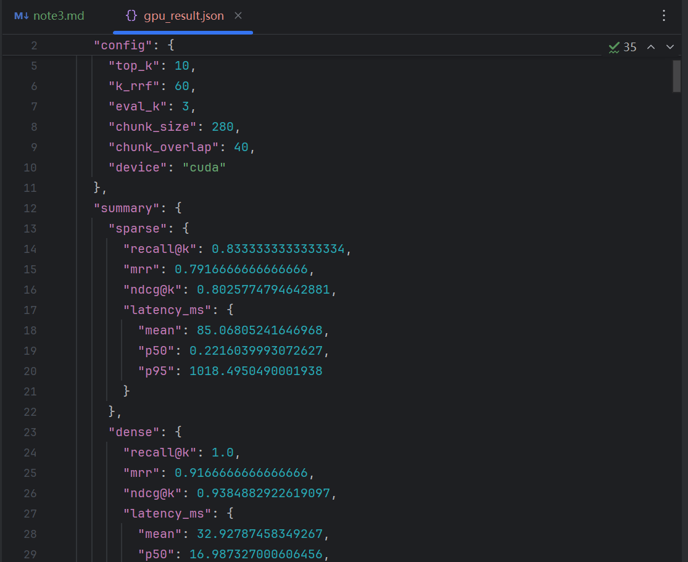

# Chapter 3 学习笔记：用户记忆和知识库

> 本章主线：**第二章解决单次任务中的上下文管理，第三章进一步解决跨会话、跨任务的持久化知识问题。用户记忆让 Agent 逐渐“懂你”，共享知识库让 Agent 获得训练参数之外的领域知识。**

---

## 一页结论

- **用户记忆与知识库解决的是同一个底层问题**：怎样把上下文窗口之外的信息可靠地保存、组织、检索和更新；区别只是前者面向单个用户，后者面向一群有权限的用户。
- **记忆不是聊天记录的无限累积**：原始对话应作为证据保存，长期记忆则应经过选择、抽象、结构化和来源核验。
- **评价记忆系统要分三层**：基础回忆、多会话检索、主动服务。会背出会员号只是第一层；能主动发现护照即将过期才接近真正的助理。
- **记忆设计有三个彼此独立的维度**：存在哪里、用什么格式存、存哪一类内容，不能混为一谈。
- **RAG 的基本流水线**：分块 → 稠密/稀疏检索 → 结果融合 → 重排序 → 将证据交给 LLM 生成答案。
- **BM25 会“认字”，Dense 会“理解意思”**：精确型号、错误码适合 BM25；同义改写、语义查询和一定程度的跨语言查询适合 Dense。
- **本次唯一完成的实验中，Hybrid-RRF 最优**：12 个查询的 Recall@3、MRR、nDCG@3 都为 1.0；它利用两路排名互补，比单独使用 BM25 或 Dense 更稳定。
- **重排序不是越复杂越好**：本次 Rerank 把 `HTTP-400` 的正确文档从第 1 名调到第 2 名，反而使 MRR 从 1.0 降至 0.9583。
- **扁平文本块并不等于知识**：统计结论、规则边界、层次关系和多跳关系需要在索引阶段主动提炼。RAPTOR、GraphRAG 和文件系统范式分别提供不同的组织方式。
- **知识写入比读取更危险**：长期知识的修改应保留原始证据、时间、来源、审核记录和回滚能力；向量索引只是可重建的服务层，不应成为唯一事实来源。
- **高级用户记忆需要双层架构**：少量结构化核心事实常驻上下文，大量原始对话通过上下文感知 RAG 按需检索。

---

## 3.1 从上下文工程到持久化知识

第二章讨论的是一次 Agent 运行期间“模型此刻看到了什么”。Chapter 3 把时间尺度向后延伸：当当前对话结束、上下文窗口被清空后，哪些信息仍然应该存在？

本章把持久化知识分成两个尺度：

| 类型 | 面向对象 | 典型内容 | 价值 |
|---|---|---|---|
| 用户记忆 | 单个用户 | 身份、偏好、经历、关系、行为模式 | 个性化与跨会话连续性 |
| 共享知识库 | 多个有权限的用户 | 法规、产品文档、公司流程、技术资料 | 专业知识与信息时效性 |

两者虽然服务范围不同，却共用许多技术：

- 向量检索与关键词检索；
- 信息压缩与摘要；
- 来源和时间标记；
- 冲突检测；
- 增量更新与定期整理；
- 权限、隐私和审计。

可以把整章理解为两条最终汇合的路线：

```text
路线 A：对话 → 提取 → 用户长期记忆 → 个性化服务
路线 B：文档 → 索引 → RAG 检索       → 领域知识
                         ↓
         RAG 技术反过来增强用户记忆检索
```

---

## 3.2 用户记忆系统

用户记忆不是保存每一句聊天，而是在会话结束后额外分析对话，从中提取将来仍有用的信息。

例如用户订机票时说：

```text
我喜欢靠窗座位，是素食者，请使用我的 United MileagePlus 号码 12345678。
```

系统可能提取：

```text
- 用户偏好靠窗座位
- 用户是素食者，乘机时需要特殊餐食
- United MileagePlus 号码为 12345678
```

而“本次搜索返回了三个选项”通常不值得成为长期记忆。

### 记忆提取的三条原则

1. **选择性**：只保留未来可能影响决策的信息。
2. **抽象化**：尝试把一次事件提炼成稳定偏好，但要避免根据单次行为过度概括。
3. **结构化**：让事实能够被准确检索、局部修改、消歧和审计。

完整的记忆生命周期可以表示为：

```text
读取当前任务所需记忆
        ↓
完成本轮对话或任务
        ↓
后台提取候选事实
        ↓
检查来源、时间、隐私、冲突和保存策略
        ↓
新增、更新、归档或保持不变
```

---

## 3.3 记忆能力的评估：三层次框架

设计记忆系统前，先要定义“记得好”的标准。书中结合 LoCoMo 等长期对话基准和商业实践，将用户记忆能力概括为个人信息保留、偏好追踪、上下文切换、记忆更新、多会话连续性、复杂思考、时间感知和冲突解决，并进一步整理为三个递进层次。

### 第一层：基础回忆

系统准确保存和取回用户直接提供的、无歧义的信息。

```text
旧会话：我的支票账户号码是 12345。
新会话：我的支票账户号码是多少？
```

这一层主要检验写入、用户绑定和精确检索是否可靠。姓名、号码、日期等内容不能被“意思差不多”地回答。

### 第二层：多会话检索

系统需要从不同时间、不同对象的会话中找到所有相关信息，再作判断。

例如用户拥有两辆车：

- 本田 Accord 已预约周五保养；
- 特斯拉 Model 3 尚未预约。

用户说“帮我的车预约服务”时，系统不能随便选择一辆，而应找出两辆车的状态并追问用户指的是哪一辆。

这一层要求处理：

- 多个相似实体；
- 有效、取消和历史状态；
- 跨会话信息组合；
- 模糊指代；
- 新旧事实冲突。

### 第三层：主动服务

系统从看似无关的记忆中发现潜在联系，在用户尚未明确提出问题时主动帮助。

例如：

```text
记忆 A：用户一月要去东京
记忆 B：用户护照二月到期
规则 C：目的地可能要求护照保有一定剩余有效期
        ↓
主动提醒用户检查并尽快续签护照
```

第三层的难点不是单纯“记住更多”，而是同时获得全局概览、精确细节、时间推理和适度的主动行为。

> **评估注意**：最终回答错误可能分别源于提取错误、存储错误、检索遗漏、冲突处理错误或推理错误。严谨评估应分阶段记录，而不能只看最终答案。

---

## 3.4 记忆的层次结构：信息放在哪里

### 轨迹（Trajectory）

轨迹是一次 Agent 运行的完整事件序列，包括用户消息、模型回复、工具调用和工具结果。它通常按时间只增不改，主要承担：

- 当前任务的即时上下文；
- 调试和错误追踪；
- 审计和事后复盘；
- 长期记忆提取的原始证据。

轨迹是“流水账”，强调完整与可追溯。

### 用户长期记忆

长期记忆是跨会话提炼出的稳定信息，例如用户偏好、家庭关系和重要经历。它会被反复合并、修订和淘汰，强调未来是否有用。

### 业务状态

业务状态表示任务所处阶段，例如“需要澄清”“等待付款”“处理中”“已完成”。它既不是完整轨迹，也不是用户的长期属性。

三个概念的区别：

| 内容 | 示例 |
|---|---|
| 轨迹 | 完整订票对话和工具结果 |
| 长期记忆 | 用户通常偏好靠窗座位 |
| 业务状态 | 当前机票订单等待付款 |

---

## 3.5 用户记忆的四种存储格式

这一节回答“同一条信息应该怎样保存”。

### Simple Notes

每条记录只保存一个不可再分的事实：

```text
用户在 TechCorp 工作。
用户是高级工程师。
用户负责推荐系统。
```

优点是简单、便宜、易于单条写入；缺点是原本属于同一件事的关联被拆散，同名实体也容易混淆。它适合大量普通事实和第一层基础回忆。

### Enhanced Notes

把相关信息保存在一个完整段落里：

```text
用户在 TechCorp 担任高级软件工程师，已有三年机器学习经验，
目前领导一个五人团队开发推荐系统。
```

它保留了叙事和上下文，但可能重复信息，局部属性改变时也需要重写整段。

### JSON Cards

按类别、子类别和键值组织：

```json
{
  "work": {
    "company": "TechCorp",
    "position": "Senior Software Engineer",
    "project": "Recommendation System"
  }
}
```

JSON 支持局部更新、格式校验和程序查询，但刚性 Schema 不一定适合多维信息。例如“周末用 Python 做个人项目”同时属于时间偏好、技术偏好和兴趣。

### Advanced JSON Cards

在事实之外加入：

- `person`：信息属于谁；
- `relationship`：该人与用户的关系；
- `backstory`：为什么保存这条信息；
- `timestamp`：信息何时获得或生效；
- `source`：原始证据在哪里。

这样可以区分用户自己的牙科医生和用户父亲的心脏科医生，即使两人都叫“张医生”。代价是生成、更新和维护成本更高。

### 实际选型

生产系统通常采用混合策略：

| 信息类型 | 建议表示 |
|---|---|
| 少量、关键、需要消歧的事实 | Advanced JSON Cards |
| 高频局部修改的属性 | JSON Cards |
| 完整事件或背景 | Enhanced Notes |
| 大量普通事实 | Simple Notes |
| 原始完整对话 | 证据归档 + RAG |

---

## 3.6 进阶表示：可执行代码

文本能够描述状态，却不擅长稳定执行聚合、约束检查和冲突检测。User as Code 将用户状态表示为带类型对象，并把规则写成确定性函数。

```python
passport = PassportInfo(
    number="AB1234567",
    country="US",
    expiry_date=date(2025, 2, 18),
)
```

随后可以可靠执行：

- 统计一年内的国际旅行次数；
- 交叉检查当前药物和过敏史；
- 比较出发日与护照到期日；
- 状态更新后自动触发规则。

它适合日期、金额、数量、明确约束和高风险规则，但不适合强行表达所有模糊偏好和叙事背景。更合理的组合是：

```text
原始证据保存完整过程
自然语言记忆保存语义
结构化状态便于查询
确定性代码执行关键规则
```

---

## 3.7 用户记忆的认知科学基础

认知科学提供的是“存什么”的分类。

### 工作记忆

对应 Agent 当前能够使用的上下文。它不是完整轨迹，而是从轨迹、长期记忆和工具结果中筛出的动态相关子集。

### 情景记忆（Episodic Memory）

记录具体事件，例如“用户上周五预订了去东京的 ANA 航班”。

### 语义记忆（Semantic Memory）

从事件中抽象出的稳定知识，例如“用户是素食者”。

### 程序记忆（Procedural Memory）

记录行为流程，例如用户订国际机票时通常“先看直飞 → 选择靠窗 → 使用会员号 → 申请素食餐”。

三套分类体系必须区分：

| 分类体系 | 回答的问题 | 类别 |
|---|---|---|
| 记忆层次 | 存在哪里？ | 轨迹、长期记忆、业务状态 |
| 存储格式 | 怎么存？ | Notes、JSON Cards、可执行代码 |
| 认知类型 | 存什么？ | 情景、语义、程序记忆 |

例如“用户偏好靠窗”可以同时是：存放于用户长期记忆中的、以 JSON Card 表示的语义记忆。

---

## 3.8 记忆框架案例

### Mem0：写入时消歧与检索时推理

早期思路是在写入时让 LLM 对候选事实执行 `ADD / UPDATE / DELETE / NOOP`。用户先说住在北京、后来搬到上海时，旧记录可能直接被更新。

优势是记忆库简洁；风险是一次错误更新会删除历史证据。

后来的思路倾向仅追加事实：北京和上海两条记录都保留时间和来源，检索时再结合语义、BM25、实体和时间判断当前有效事实。这种设计减少不可逆删除，也更适合审计。

### Memobase：用户画像与事件记忆

- Profile 保存姓名、兴趣、工作等相对稳定的属性，近似语义记忆；
- Event Memory 按时间保存具体经历，近似情景记忆；
- 通过缓冲批处理摊薄记忆提取的 LLM 成本。

框架通常只实现设计空间中的一部分。实际系统应该围绕业务需要选择组件，不必追求形式上的“大而全”。

---

## 3.9 记忆压缩与整理

无限追加会造成记忆爆炸和检索噪声。书中给出三层压缩思路。

1. **重要性筛选**：综合访问频率、时间衰减、情感强度和信息独特性。
2. **聚类摘要**：把相似记忆归组，生成代表性摘要，原始细节转入二级存储。
3. **抽象泛化**：从多次情景记忆中提炼语义或程序记忆。

需要避免两个误区：

- “很久没访问”不等于“不重要”，护照号等信息可能长期低频但关键；
- 一次行为不一定代表稳定偏好，抽象结果应保留证据、时间和置信度。

---

## 3.10 隐私保护：日志脱敏

用户记忆可能包含身份证号、银行卡号、地址、医疗信息、密码和家庭关系。如果把日志先发送到云端再脱敏，隐私已经暴露，因此书中方案使用本地小模型识别 PII。

生产环境可以采用：

```text
正则表达式快速识别固定格式
          ↓
本地模型识别自然语言敏感信息
          ↓
输出类型、位置和置信度
          ↓
删除、遮盖、令牌化或限制访问
```

脱敏日志不等于安全保存业务机密。确实需要使用的账号、证件等应进入专用机密存储，只在授权工具执行时短暂读取，而不应长期以明文进入 LLM 上下文。

---

## 3.11 RAG 基础：构建 Agent 的知识获取管道

RAG（Retrieval-Augmented Generation）的基本思想是把 LLM 的生成能力与外部知识库结合：

```text
用户问题
  ↓
检索相关资料
  ↓
将资料注入上下文
  ↓
LLM 基于证据生成答案
```

它让知识可以在模型重新训练之前独立更新，但并不会自动保证正确。失败可能来自分块、召回、排序、上下文注入或最终推理中的任何一步。

### 文档分块（Chunking）

长文档不能简单压成一个向量，因为多个主题会互相稀释；把整篇文档送进上下文也会引入大量无关内容。

常见策略：

- **固定大小切分**：简单稳定，但可能切断段落、表格或代码；
- **递归/结构感知切分**：优先按标题、段落、句子切分，是 Markdown/HTML 常用默认方案；
- **语义切分**：在相邻句子语义相似度明显下降的位置切分，质量较高但计算更贵。

块太小会丢上下文，块太大则主题混杂。书中建议可从 256～1024 token、10%～20% 重叠开始，再用真实数据调优。

---

## 3.12 稠密嵌入：按语义检索

Dense 检索用神经网络把文本转换成向量，使语义相近的表达在向量空间中彼此接近。

常用余弦相似度：

$$
\cos(\theta)=\frac{A\cdot B}{\lVert A\rVert\lVert B\rVert}
$$

它主要比较向量方向而非长度。语义越接近，余弦值通常越接近 1。

### 从 Word2Vec 到上下文感知模型

Word2Vec 为每个词分配固定向量，因此无法区分 `river bank` 和 `investment bank`。BERT、BGE-M3 等上下文模型会参考完整句子，使同一个词在不同语境中获得不同表示。

### ANN 索引

百万级向量无法逐个比较，需要 Approximate Nearest Neighbor 索引：

| 算法 | 特点 | 适用场景 |
|---|---|---|
| ANNOY | 构建快、内存较低、不支持自然增量更新 | 数据变化不大的静态知识库 |
| HNSW | 精度高、支持增量插入、内存较高 | 持续新增知识的动态场景 |

嵌入模型决定“怎样表达语义”，ANN 索引决定“怎样快速找到相近向量”，两者是不同的工程选择。

---

## 3.13 稀疏嵌入：按关键词检索

Sparse 检索基于词汇精确匹配，适合产品型号、姓名、错误码、法条编号和专业术语。

### TF-IDF

直觉是：一个词在当前文档中越常见、在整个语料库中越少见，它越能代表当前文档。

$$
\text{TF-IDF}(t,d)=\text{TF}(t,d)\times\text{IDF}(t)
$$

### BM25

BM25 在此基础上加入：

- 词频饱和：同一词从 1 次增加到 2 次比从 100 次增加到 101 次更有价值；
- 文档长度归一化：长文档不能只因包含更多词就天然占优。

倒排索引建立的是“词 → 包含该词的文档”，类似书末术语索引。BM25 的主要短板是不理解同义词和跨语言表达。

---

## 3.14 混合检索与重排序

稠密和稀疏检索互补：

| 方法 | 强项 | 盲区 |
|---|---|---|
| BM25 / Sparse | 精确词、编号、名称、错误码 | 同义改写、跨语言、隐含语义 |
| Dense | 同义表达、改写、语义关联 | 相似型号和专有代码可能混淆 |

典型流水线：

```text
BM25 候选 ─┐
            ├→ 融合 → Cross-Encoder 重排序 → Top-k 上下文
Dense 候选 ─┘
```

### RRF：按排名融合

BM25 分数和余弦相似度量纲不同，不能直接比较。RRF 丢开原始分数，只依据每一路的名次：

$$
\text{RRF}(d)=\sum_i\frac{1}{k+\operatorname{rank}_i(d)}
$$

本实验使用 `k=60`。一篇文档如果在两路结果中都靠前，综合排名就会提升。

### Weighted：按归一化分数融合

Weighted 先处理两路分数，再加权相加。它保留了分数强弱信息，但结果对归一化方法、权重和数据分布更敏感。

### Rerank：跨编码器精排

Dense 初筛通常使用双编码器，查询和文档分别编码，速度快；Rerank 将查询和候选文档拼在一起交给跨编码器逐词比较，速度更慢但理论上判断更细。

重排序只负责重新排列候选，不能找回前一阶段完全没有召回的文档。

---

## 3.15 实测：五种检索方法对比

> 这是本章目前实际运行并保留结果的实验，对应书中实验 3-6。其余实验在本笔记中只作为书本方案介绍。

### 实验设置

可以把实验想象成：在一个只有 20 篇文档的小型图书馆里提出 12 个问题，系统需要找到正确文档，并尽量把它排在最前面。

主要配置：

| 配置项 | 值 |
|---|---|
| Dense 模型 | `sentence-transformers/all-MiniLM-L6-v2` |
| Reranker | `BAAI/bge-reranker-base` |
| 初始候选数 `top_k` | 10 |
| RRF 常数 `k_rrf` | 60 |
| 评估范围 `eval_k` | 3 |
| 分块大小 | 280 |
| 分块重叠 | 40 |
| 设备 | CUDA |

### 实验截图



截图展示了运行配置以及结果文件中的部分汇总指标。完整数值来自同一次运行生成的 `retrieval-pipeline/gpu_result.json`。

### 汇总结果

| 方法 | Recall@3 | MRR | nDCG@3 | 平均端到端延迟 |
|---|---:|---:|---:|---:|
| BM25 / Sparse | 0.8333 | 0.7917 | 0.8026 | 85.07 ms |
| Dense | 1.0000 | 0.9167 | 0.9385 | 32.93 ms |
| Hybrid-RRF | **1.0000** | **1.0000** | **1.0000** | 118.02 ms |
| Hybrid-Weighted | 1.0000 | 0.9583 | 0.9692 | 118.02 ms |
| Rerank | 1.0000 | 0.9583 | 0.9692 | 158.72 ms |

> 延迟只反映这次很小的数据集和当前运行环境。Sparse 的中位数仅约 0.22 ms，但一次约 1018 ms 的慢查询显著抬高了平均值，因此不能仅凭平均延迟断言 BM25 比 Dense 慢。实际部署应区分冷启动、预热后延迟和不同分位数。

### BM25：按关键词找

搜索 `XR-7003` 时，BM25 可以精确命中包含该型号的文档，特别适合产品编号、姓名和错误码。

但面对中文查询：

```text
植物如何把阳光转化为食物
```

而正确英文文档写的是：

```text
Green plants convert sunlight into chemical energy...
```

两边缺少可直接匹配的词，Sparse 在该查询上没有召回正确文档。整体 Recall@3 因此为 0.8333，即 12 个问题中有 10 个在前三名找到正确答案。

### Dense：按意思找

Dense 能将上述中文查询与英文光合作用文档关联起来，说明向量模型具备一定的语义和跨语言匹配能力。

但搜索 `XR-7003` 时，`XR-7001`、`XR-7002`、`XR-7003` 等型号在自然语言语义上非常接近，正确文档只排第 2。Dense 的 Recall@3 达到 1.0，但 MRR 为 0.9167，说明所有正确答案都进入前三，却并非每次都排第一。

### Hybrid-RRF：两位专家按排名投票

对于精确型号，BM25 把正确文档排在第一；对于同义改写或跨语言问题，Dense 提供有效召回。RRF 根据两路排名融合，使它们互相纠错。

本次结果：

```text
Recall@3 = 1.0000
MRR      = 1.0000
nDCG@3   = 1.0000
```

这表示 12 个问题的正确文档不仅全部进入前三，而且全部排在第一名。就本次数据而言，Hybrid-RRF 是表现最好的方案。

### Hybrid-Weighted：按分数加权

Weighted 同样融合 BM25 和 Dense，但使用归一化后的分数。由于两路原始分数的含义和分布不同，即使归一化也不一定完全公平。

它的 Recall@3 为 1.0，但 MRR 为 0.9583、nDCG@3 为 0.9692，优于单路检索，却不如本次 RRF 稳定。

### Rerank：第三位专家重新审查

理论上，跨编码器可以更深入地比较查询和候选文档。但在这个很小的数据集上，RRF 已经把所有正确答案排在第一，继续精排没有提升空间。

对于 `HTTP-400`：

```text
RRF：正确文档 http_400 排第 1
Rerank：错误地把 http_404 提到第 1，http_400 降到第 2
```

因此 Rerank 的 MRR 从 RRF 的 1.0 降到 0.9583，同时平均延迟增加到约 158.72 ms。

这说明：

> 重排序通常有潜力提高精度，但并不是加入后必然变好。模型是否适合当前语言、文档类型、精确代码和候选规模，都必须通过真实评估验证。

### 三个指标理解

#### Recall@3：有没有找进前三名

正确答案排第 1、第 2或第 3都算命中。它首先回答“该找的资料有没有被召回”。

严格来说，本实验每个查询只有一篇标注相关文档，因此这里的 Recall@3 与 Hit Rate@3 数值相同；如果一个问题有多篇相关文档，标准 Recall@k 还要计算召回了其中多少篇。

#### MRR：第一个正确答案有多靠前

- 第 1 名得 1；
- 第 2 名得 1/2；
- 第 3 名得 1/3；
- 未找到得 0。

MRR 为 1.0 表示每个查询的第一个正确答案都排第一。

#### nDCG@3：前三名整体排序是否合理

nDCG 会让排名靠后的相关结果获得折扣，也能处理不同相关等级。可以简化记忆为：

```text
Recall：找没找到
MRR：第一个正确结果是否足够靠前
nDCG：整个结果列表的排序质量如何
```

### 实验结论与边界

本次实验支持以下结论：

- 精确编号、名称和术语，BM25 更可靠；
- 同义词、改写和跨语言问题，Dense 更可靠；
- 混合检索比单独使用任一路更稳定；
- 本数据集上 RRF 是最佳方案；
- Rerank 需要按真实数据验证，不能因为更复杂就默认开启。

但不能从这 20 篇文档、12 个查询推出“RRF 在所有系统中都最好”。更可靠的下一步是扩大文档和查询集、增加每题多篇相关文档、重复测量预热后的延迟，并分别统计技术代码、姓名、语义改写和跨语言类别。

一句话总结：

> **BM25 会认字，Dense 会理解意思，RRF 让二者互相纠错；这次重排序没有锦上添花，反而改错了一道题。**

---

## 3.16 超越扁平文本：知识为什么需要组织

检索算法解决“怎样找到相关文本块”，却没有解决“文本块本身应怎样组织”。扁平切块会丢失层次、统计、规则边界和跨文档关系。

### 黑猫白猫案例

知识库有 100 个独立案例：90 只黑猫、10 只白猫。用户问比例时，Top-20 检索不可能保证取回全部案例，LLM 只能从不完整样本推测。

更可靠的做法是在索引期生成：

```text
共有 100 只猫：黑猫 90 只（90%），白猫 10 只（10%）。
```

### 优惠资格案例

几百条客服工单各自只记录某个人是否获批，任何一条都没有写完整的资格边界。最近邻检索只能找到“与护士相似的医生”或“不符合条件的教师”，却不能证明完整规则。

应离线通读全库并提炼带边界的规则卡，例如哪些职业适用、哪些明确不适用。结论是：

> 原始案例不等于可直接使用的知识。索引期必须投入计算，主动统计、归纳、建立边界并保留来源。

---

## 3.17 结构化索引：RAPTOR 与 GraphRAG

### RAPTOR：树状层次

RAPTOR 将小文本块作为叶子，聚类相似内容并由 LLM 生成父级摘要，再递归形成从细节到概览的知识树。

它适合：

- 从宏观概念逐步深入细节；
- 在不同抽象粒度上检索；
- 对长技术手册建立层次导航。

### GraphRAG：实体关系图

GraphRAG 将知识建模为实体—关系—实体三元组，例如：

```text
用户 → 就诊于 → 张医生
张医生 → 任职于 → 中心医院
中心医院 → 地址 → 某街道
```

它擅长：

- 多跳关系推理；
- 同名实体消歧；
- 查询多个实体之间的联系；
- 发现知识图谱中的主题社区。

局限是自然语言转为三元组时可能发生语义降级。条件、否定和时间依赖尤其容易丢失。例如“如果下周还下雨，我就取消海边计划，改去博物馆”不能被几条孤立三元组完整表达。

因此推荐：完整自然语言保存语义，结构化元数据和图谱负责索引；只在确实需要多跳关系和精确消歧的场景承担额外成本。

---

## 3.18 文件系统范式：OpenViking

OpenViking 把资源、用户记忆和 Agent 技能统一映射到虚拟文件系统，并为每个条目建立：

- L0：约 100 token 的摘要，用于快速判断相关性；
- L1：约 2000 token 的概览，用于规划；
- L2：完整原文，仅在需要时加载。

这与第二章 Skills 的渐进式披露相同：先看轻量元信息，再按需深入，把 token 用在真正相关的内容上。

Markdown 和文件系统的优势是人可以直接查看和修改，也能使用 Git 审核、回滚和追责。但知识文件之间必须建立入口页、索引页和交叉链接，否则只是把数据库碎片变成文件碎片。

---

## 3.19 知识应该如何更新

完整机制要同时包含事件触发的增量更新和周期触发的全量整理。

### 增量更新：把知识变更当作 PR

```text
原始证据
  ↓
Proposer Agent 在工作分支提出最小 diff
  ↓
Reviewer Agent 对照证据独立审核
  ↓
修改与复审，必要时转人工
  ↓
CI 检查格式、链接、权限、类型和测试
  ↓
合并后重建受影响的摘要与索引
```

系统应区分：

1. 原始证据层：对话、轨迹、文档和工具输出，只增不改；
2. 知识层：经过提炼、审核、可持续修订的 Markdown 或代码；
3. 服务层：分块、摘要、向量等可从知识层重建的派生物。

### 定期整理

局部更新长期积累会产生重复、冲突、摘要漂移和目录退化，因此还要周期性：

- 去重、合并、淘汰过时表达；
- 回到原始证据核对摘要；
- 补充适用时间、人物、地区和前置条件；
- 重建链接、目录和索引；
- 回放典型检索与问答用例。

冲突不能简单采用“最新一条”。两条信息可能在不同时间或不同场景下都成立；证据不足时应保留冲突和待确认状态。

### 权限与租户隔离

权限过滤必须下推到检索层。不能先把越权文档放入模型上下文，再要求模型不要说出来；敏感内容一旦进入上下文，泄露风险已经产生。

---

## 3.20 智能体化 RAG

传统 RAG 通常只搜索一次：

```text
用户问题 → 一次检索 → 注入结果 → 生成答案
```

智能体化 RAG 将知识库搜索变成 Agent 可以反复调用的工具：

```text
分析并拆分问题
  ↓
执行第一轮搜索
  ↓
判断证据是否充分
  ↓
调整查询、继续检索或交叉验证
  ↓
证据充分后综合回答
```

简单、明确的问题使用传统 RAG 往往更快。多跳、条件复杂或首次搜索不完整的问题更适合智能体化 RAG。

### 安全边界

检索内容可能包含间接提示注入或知识库投毒。防御原则：

- 明确标注外部资料是数据而不是指令；
- 保存来源和可信等级；
- 外部文本不能直接触发转账、删除、发信等高风险动作；
- 高风险操作必须经过独立授权判断。

---

## 3.21 用智能体化 RAG 构建用户记忆

可以把完整对话历史当作一个知识库，给 Agent 提供 `search_user_memory` 工具。

基础回忆通常一次搜索即可；多会话检索则需要根据初步结果继续查找。例如先检索到本田保养记录，又从其中发现用户还有特斯拉，再进行第二次搜索。

局限是固定窗口切出的对话块彼此孤立。妻子设立转账、丈夫修改、妻子再次修改的三个块若缺乏人物、时间和前后关系，Agent 很难判断最终有效指令。这引出了下一节的上下文感知检索。

---

## 3.22 RAG 技巧：上下文感知检索

普通分块可能只剩一句：

```text
该公司第二季度收入增长了 3%。
```

但“该公司是谁、哪一年、来自哪份报告”都在块外。上下文感知检索在索引前为每个块生成简短前缀：

```text
[本段来自 ACME 公司 2025 年 Q2 财务报告的关键业绩章节]
该公司第二季度收入增长了 3%。
```

前缀既增加 BM25 可匹配的关键词，也让 Dense 向量包含正确的实体、时间和语义背景。

与第二章的上下文感知压缩区别：

| 技术 | 时机 | 对象 | 操作 |
|---|---|---|---|
| 上下文感知检索 | 索引期 | 知识库文本块 | 添加背景，做加法 |
| 上下文感知压缩 | 运行期 | 当前对话历史 | 删除无关信息，做减法 |

应用到对话记忆后，“好的，就订这个吧”可以被补充为“用户确认预订上海到西雅图、500 美元的单程机票”，从而获得可检索性。

---

## 3.23 双层记忆架构

要实现第三层主动服务，书中最终将两条路线合并：

```text
第一层：Advanced JSON Cards / 类型化状态
        少量、关键、结构化，常驻上下文
        作用：提供全局概览，发现潜在关联

第二层：上下文感知 RAG
        大量原始对话，按需检索
        作用：验证细节、时间、人物和来源
```

只使用结构化概览会因容量限制丢失细节；只使用 RAG 又可能因为缺少全局视野而根本不知道应搜索什么。两层结合后，Agent 才可能从“东京旅行”和“护照到期”两个核心事实发现风险，再回查原始对话确认并主动提醒。

---

## 3.24 从数据集中提取深度知识

专业知识有时不是写在某篇文档里的规则，而是隐含在大量案例中。例如司法判例中，量刑经验分散在犯罪动机、伤害程度、自首、赔偿和社会影响等因素中。

书中提出两阶段流程：

1. **知识提取与结构化**：让 LLM 把非结构化案例转换为统一 JSON；
2. **因子分析与重要性建模**：把类别编码为特征，通过统计和聚类发现案件原型与关键因子。

最终 Agent 可以根据因子重要性主动追问缺失信息，再检索相似案件原型并提供有数据依据的解释。这使知识库从静态资料仓库升级为经过提炼的决策知识。

---

## 3.25 前沿探索：多模态记忆

文字难以完整保存人脸和声音，书中提出三种方向：

1. 保存原始图片/音频，同时生成文本描述和索引；
2. 保存多模态嵌入，通过向量相似度识别人脸或声纹；
3. 将信息写入模型参数或专门的可寻址内部记忆槽。

第三种方向扩展性更强，但依赖底层模型架构支持，仍属于前沿探索。书中关于嵌入可被压缩为极少上下文 token 的描述也应理解为特定架构设想，而非所有通用 LLM 当前都能直接使用的标准能力。

---

## 本章知识地图

```text
跨会话持久化知识
├── 用户记忆
│   ├── 评估：基础回忆 → 多会话检索 → 主动服务
│   ├── 层次：轨迹 / 长期记忆 / 业务状态
│   ├── 格式：Simple Notes → Enhanced Notes → JSON Cards → Advanced JSON Cards
│   ├── 类型：情景 / 语义 / 程序记忆
│   ├── 高级表示：可执行状态与规则
│   └── 治理：压缩、冲突、隐私、来源、审核
│
└── 共享知识库
    ├── 分块：固定 / 结构感知 / 语义
    ├── 检索：BM25 + Dense
    ├── 融合：RRF / Weighted
    ├── 精排：Cross-Encoder Rerank
    ├── 组织：RAPTOR / GraphRAG / 文件系统
    ├── 控制：Agentic RAG
    └── 增强：Contextual Retrieval

最终汇合：结构化概览常驻 + 原始细节按需召回
```

---

## 容易混淆的概念

### 轨迹、工作记忆、长期记忆

- 轨迹：完整、按时间追加的原始事件；
- 工作记忆：当前任务动态选中的相关子集；
- 长期记忆：跨会话提炼的稳定知识。

### 稀疏检索与稠密检索

- 稀疏检索看词是否匹配；
- 稠密检索看语义向量是否接近。

### 融合与重排序

- 融合负责把多路候选合成统一候选池；
- 重排序负责对候选池进行更精细的重新排列；
- 重排序不能补回未被召回的文档。

### 上下文感知检索与上下文感知压缩

- 前者在索引期给知识块补背景；
- 后者在运行期从会话历史删冗余。

### 用户记忆与经验学习

- 用户记忆描述“关于这个用户，什么是真的”；
- 经验学习描述“在什么条件下，怎样做更有效”；
- 一次成功操作不能未经验证就直接上升为可靠程序经验。

---

## 复习问题

1. 为什么不能直接把完整聊天记录当作用户长期记忆？
2. “用户喜欢靠窗座位”分别属于哪一种记忆位置、存储格式和认知类型？
3. 为什么只保留最新地址可能破坏历史和审计能力？
4. BM25 为什么适合 `XR-7003`，却无法处理本次中文光合作用查询？
5. Dense 为什么能处理语义改写，却可能混淆 `XR-7001` 和 `XR-7003`？
6. RRF 为什么不直接相加 BM25 与余弦相似度分数？
7. 为什么本次 Rerank 反而降低了 MRR？这能否证明重排序无用？
8. RAPTOR 与 GraphRAG 分别更适合哪类问题？
9. 为什么知识索引应是可重建的派生物，而不是唯一事实来源？
10. 为什么第三层“主动服务”需要结构化概览和原始细节检索同时存在？

---

## 最终总结

Chapter 3 的核心不是“选哪个向量数据库”，而是建立一套完整的持久化知识工程：

```text
原始证据可追溯
      +
知识表示可更新
      +
检索流程可评估
      +
冲突与隐私可治理
      +
关键事实和原始细节相互补充
```

成熟的 Agent 不应只是保存更多聊天，而应把原始证据、结构化概览、可执行状态和按需检索组织成一个可追溯、可审查、可回滚的知识体系。
