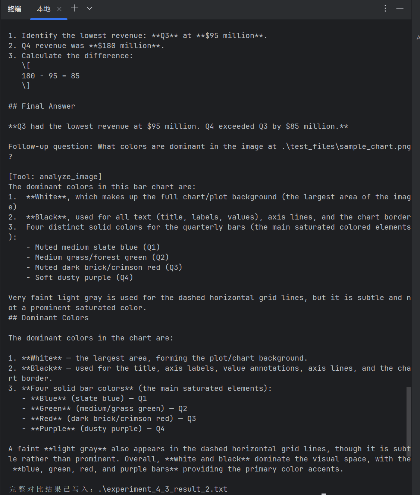
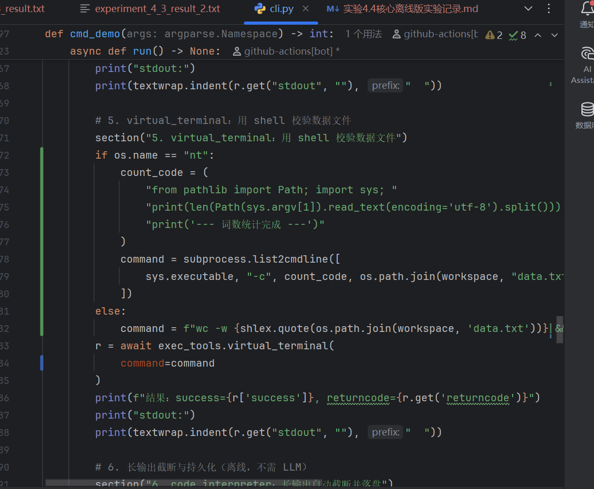

# 第 4 章笔记：把 Agent 的“聪明”变成可控、可用的产品能力

> 更新时间：2026-09-22

## 一页结论

Agent 产品的能力上限，不只取决于模型，更取决于它能否通过工具可靠地获取信息、改变外部世界并与人或其他 Agent 协作。对产品经理而言，第 4 章可以压缩成六个判断：

1. **先定义业务动作，再定义工具。** 工具应面向 Agent 的目标，而不是机械照搬底层 API；这是 ACI（Agent-Computer Interface）而不是普通 API 封装。
2. **能力形态与披露策略是两个独立决策。** “做成专用工具、通用执行器还是 Skill”决定单项能力的结构、安全与维护成本；“一次让模型看到多少工具”决定上下文成本和选择难度。
3. **感知工具优化信息效率，执行工具控制副作用，协作工具管理责任边界。** 三类工具不能套用同一套验收标准。
4. **工具描述本身就是产品界面。** 什么时候用、什么时候不能用、参数示例、返回格式和调用代价，都会直接影响成功率。
5. **能自动验证的结果必须自动验证。** “调用成功”不能代替“业务结果正确”；执行后应形成“执行—验证—反馈”闭环。
6. **真实凭据缺失应记为 blocked，而不是用 mock 写成 passed。** 这是 Agent 产品可信度的底线。

---

## 1. 第 4 章的产品地图：五类工具

| 工具类型 | 谁发起 | 产品作用 | 主要风险 | PM 最关心的指标 |
| --- | --- | --- | --- | --- |
| 感知工具 | Agent 主动调用 | 搜索、读取、理解外部信息 | 上下文爆炸、信息缺失、过期数据 | 信息覆盖率、事实正确率、延迟、截断率 |
| 执行工具 | Agent 主动调用 | 写文件、运行代码、修改外部系统 | 数据损失、重复操作、越权和资源消耗 | 成功率、误操作率、回滚率、审批命中率 |
| 协作工具 | Agent 主动调用 | 委派子 Agent 或请求人类决策 | 上下文泄漏、责任不清、超时 | 交接质量、等待时间、取消率、人工响应率 |
| 用户沟通工具 | Agent 主动调用 | 回复、卡片、跨渠道通知 | 错发、重复发送、打扰用户 | 送达率、重复率、退订/投诉率 |
| 事件触发工具 | Agent 注册、外部触发 | 定时或由外部事件唤醒 Agent | 重复触发、漏触发、状态不一致 | 触发成功率、去重率、延迟 |

本章重点展开前三类。用户沟通与事件触发依赖异步运行时，在第 6 章继续讨论。

## 2. 能力应该做成工具、执行器还是 Skill

### 2.1 三种表达形态

| 形态 | 优势 | 代价 | 适合场景 |
| --- | --- | --- | --- |
| 专用工具 | JSON Schema 约束强、可测试、可细粒度授权和审计 | 每个工具都有上下文成本，数量多时模型难选 | 付款、生产写入、复杂表单、高频关键动作 |
| 通用执行器 | 一个 Python/Shell 工具覆盖大量长尾需求，可用代码编排多步任务 | 能力开放，必须配套沙盒和权限 | 数据处理、自动化、探索型任务 |
| Skill | 文档化、易维护、按需阅读、常驻 token 少 | 参数转义和平台差异更容易出错，模型要求更高 | 频繁变化的流程、操作手册、低风险能力 |

### 2.2 产品决策顺序

默认先考虑“Skill + 通用执行器”，出现以下情况时退回专用工具：

- 涉及不可逆操作、精细权限或审计；
- 参数包含嵌套对象、多字段联合校验；
- 使用频率极高，需要稳定、清晰的入口；
- 需要屏蔽 Windows、macOS、Linux 或不同供应商差异。

一个实用原则是：**稳定而危险的底层动作做成专用工具，变化快的业务流程写成 Skill，长尾计算和编排交给通用执行器。**

## 3. 工具接口就是 Agent 的产品界面

### 3.1 描述重点不是“能做什么”，而是“什么时候用”

高质量工具描述至少应包含：

- 使用时机，例如“需要实时信息时使用”；
- 反例和边界，例如“只能按文件名搜索，不能搜索文件内容”；
- 参数示例，例如直接给出 RFC3339 时间戳样例；
- 返回结构，例如说明每项包含 `title`、`url`、`snippet`；
- 调用代价，例如耗时、收费、是否产生外部副作用；
- 1—5 个真实调用示例，帮助模型理解参数组合。

当 Agent 频繁选错工具时，应先检查描述和边界，而不是第一时间升级模型。

### 3.2 参数必须保真

工具不能在模型不知情时修改输入，例如把中文弯引号静默替换为直引号，或给命令自动追加参数。否则模型看到的世界与工具实际操作的世界不一致，会产生难以解释的循环失败。

如果必须规范化输入，应明确返回转换内容，保留原始值并留下审计记录。

## 4. MCP 与 Skill Hub：接入能力，也扩大信任边界

MCP 用统一协议连接专用工具、资源和提示模板，优势是“一次开发，多端复用”；Skill Hub 更像包管理器，分发包含 `SKILL.md` 和脚本的文件夹，常驻上下文通常更少。

| 维度 | MCP | Skill Hub |
| --- | --- | --- |
| 主要对象 | 结构化工具、资源、提示 | 文档、脚本、模板和流程 |
| 接入方式 | 本地 stdio 或远程 HTTP | 安装文件夹，按需读取 |
| 常驻成本 | 可能注入大量工具 schema | 通常只暴露名称和简介 |
| 核心风险 | 描述投毒、恶意服务器、同名工具遮蔽 | 描述投毒、恶意代码、安装时供应链攻击 |

产品治理要求：审查 description、锁定版本、升级时重新审查、凭据最小化、第三方代码隔离运行。Skill 能携带并执行代码，因此不能因为“只是文档”而降低安全等级。

## 5. 工具太多：从全量暴露转向渐进式披露

工具超过百个后，问题不只是 token 贵，而是模型选择质量下降。推荐的产品演进路径是：

1. 按搜索、读取、解析、查询等类别分层；
2. 默认只暴露索引，需要时加载完整定义；
3. 用语义检索预筛候选；
4. 让 Agent 在执行中声明能力缺口，动态发现工具；
5. 对流程型能力优先使用 Skills，像查手册一样逐层读取。

动态加载时，已经加载的 schema 应固定在首次出现的位置，避免反复重排破坏 KV Cache。

### 实验 4-1：主动工具发现的真实结果

正式实验使用本地 Qwen3-4B、127 个完整工具 schema 和三个跨领域任务：

| 指标 | 全量注入 | 主动发现 |
| --- | ---: | ---: |
| 任务完成 | 3/3 | 3/3 |
| 准确率 | 100% | 100% |
| 实测耗时 | 3,056.294 秒 | 783.442 秒 |
| 速度差异 | — | 约 3.90× 更快 |
| schema 暴露 | 每个任务 50,829 system tokens | 每任务初始 1,251 tokens，三任务动态合计 8,424 tokens |

实验没有观察到预期的准确率提升，但证明了明显的速度和上下文成本优势。同时，实验轨迹仍出现无关调用、JSON 错误和过早结束，说明“最终完成”不能替代过程质量指标。

**产品含义：**主动发现首先是成本和规模能力，不应在没有数据时包装成准确率提升；上线指标还应包含无关调用率、重试次数和提前结束率。

## 6. 感知工具：重点是信息量与证据完整性

感知工具通常只读，因此天然适合缓存和并行。产品设计重点包括：

- 搜索返回结构化候选列表，不要直接倾倒全文；
- 支持分页或 cursor，让 Agent 决定是否继续；
- 文件读取提供 offset/limit；
- 截断必须显式说明省略量和继续读取方法；
- 图片、复杂表格和 UI 等布局敏感内容保留视觉输入；
- 纯文字文档优先提取文本，以降低 token 成本。

### 实验 4-2：感知 MCP 的真实结果

真实 MCP 调用已通过网络和知识库搜索、HTTPS 下载、网页读取、PDF/DOCX/PPTX 提取、OCR、本地 Whisper、视频解析、图像/视频 AI 分析、受限文件操作以及天气、股价、汇率、Wikipedia、ArXiv 等公开数据源。

Google Calendar 和 Notion 因没有可用授权保持 `blocked`，因此正式状态不是完整通过。第一次图像服务还因国际区 Key 误连中国大陆端点收到 401；修正到国际端点后成功。这说明区域、凭据和 endpoint 应作为产品配置的一等公民。

## 7. 实验 4-3：多模态三种范式如何选

### 7.1 三种范式

| 范式 | 产品优势 | 产品代价 | 推荐场景 |
| --- | --- | --- | --- |
| 原生多模态 | 保留布局、空间关系和视觉细节，能力上限最高 | 视觉 token 和调用成本较高 | 图表、设计稿、复杂混排文档 |
| 提取为文本 | 可缓存、可搜索、可交给普通文本模型 | 丢失布局和数值对应关系 | 纯文本 PDF、批量归档、低成本检索 |
| 工具按需分析 | 先走低成本文本路径，证据不足再查看原图 | 多一次决策与工具调用，延迟最高 | 交互式问答、成本敏感但不能牺牲正确性 |

实验输入是一张柱状图，精确数值只存在于图表中：

### 7.2 本机真实演示结果（Windows，Doubao-Seed-2.1-pro/260915）

本机使用同一张 PNG、同一模型，运行了两个问题：

1. 哪个季度收入最高，准确金额是多少？正确答案为 Q4、$180M。
2. 哪个季度收入最低，金额是多少，Q4 高出多少？正确答案为 Q3、$95M、相差 $85M。

| 模式 | 问题 1 | 问题 2 | 本机结果 |
| --- | --- | --- | --- |
| 原生多模态 | 正确 | 正确 | 2/2 |
| 提取文本 | 正确 | 正确 | 2/2 |
| 提取文本 + 工具 | 正确 | 正确 | 2/2 |

三种模式合计 6/6 正确，且工具模式在后续颜色问题中真实调用了 `analyze_image`。

但这次演示的“提取文本”由视觉大模型生成高质量图片描述，并非普通 OCR；描述已经包含完整的季度、金额和空间对应关系。因此，本机演示证明三条程序路径可用，却不能证明提取文本的能力弱于原生视觉。工具调用也发生在预设的颜色追问，而不是原问题证据不足时自主触发。

### 7.3 仓库正式实验结果

正式留存实验同时使用 PNG、PDF、两个问题和四个 case，并保留真实视觉调用、工具轨迹、token、延迟和 Moonshot 外部裁判：

| 模式 | case 数 | 精确准确率 | 外部裁判准确率 | 平均延迟 |
| --- | ---: | ---: | ---: | ---: |
| 原生多模态 | 4 | 100% | 100% | 8.011 秒 |
| 提取为文本 | 4 | 0% | 0% | 10.867 秒 |
| 工具按需分析 | 4 | 100% | 100% | 29.795 秒 |

正式实验使用普通文本提取后，季度与数值的空间对应关系丢失，因此纯文本模式失败；工具模式能识别证据不足并调用视觉工具恢复正确答案，但平均延迟约为原生模式的 3.7 倍。

**产品结论：**

- 简单、视觉核心任务直接使用原生多模态；
- 文本占主导且可接受少量信息损失时使用文本提取；
- 大规模文档问答采用“文本优先、视觉升级”的分层路由，并设置升级理由、预算和超时；
- 评测必须固定提取器。若“文本提取”本身就是强视觉模型，三种方案的边界会被人为抹平。

## 8. 执行工具：产品核心不是“能做”，而是“出错时不会失控”

执行工具会改变外部世界，推荐采用分层防护：

1. **输入验证**：路径、类型、格式、命令注入检查，异常立即失败；
2. **权限控制**：限定工作区、最小权限凭据、配额和速率；
3. **事前审批**：对不可逆、高影响操作使用独立 Reviewer；
4. **Sidecar 门控**：轻量模型只读取结构化调用参数，避免被自由文本提示注入；
5. **沙盒执行**：生产环境至少使用容器，不可信代码优先 microVM；
6. **事后验证**：代码跑 linter，配置实际启动，文档渲染后视觉检查；
7. **可观测性**：记录参数、结果、耗时、审批理由、资源使用与回执；
8. **幂等与取消**：使用唯一请求 ID 或“先查询后变更”，避免超时重试产生重复副作用。

长输出不应全部进入上下文：保留头尾，完整结果写入文件，并把文件位置返回给 Agent。

### 8.1 本机实验 4.4：核心离线版结果

当前 Windows 环境在不使用外部 API Key 的情况下完成了七项验证：

| 步骤 | 结果 |
| --- | --- |
| 写入合法 Python 并自动校验 | 通过，`verification=passed` |
| 写入语法错误文件 | 成功拦截并返回错误行 |
| 写入样本文本 | 成功，64 字节 |
| 执行词频统计 | `apple: 4`、`banana: 3`、`cherry: 2` |
| 终端校验词数 | 10 |
| 生成 1,000 行输出 | 上下文只保留头尾 102 行，全文持久化 |
| 请求危险删除命令 | 审批不可用时按 fail-safe 原则拒绝 |

Windows 使用本地子进程作为降级执行环境，它不是强沙盒；Python venv 也只隔离包，不隔离文件、网络和进程。此路径适合受控演示，不应执行来源不可信的代码。

### 8.2 正式实验 4.4：13/15 门禁通过

正式 MCP 实验共有 15 个门禁，实际通过 13 个，保留 20 份工具回执和 3 次 LLM 调用记录。已通过：

- Python/JavaScript linter、结构化错误、工作区逃逸拒绝；
- 终端超时与 LLM 危险命令审查；
- Docker Python 沙盒：禁网、只读根目录及内存/CPU/PID 限制；
- 长输出截断与不可变全文持久化；
- Excel 公式、LibreOffice 渲染和截图；
- 真实 HTTPS Webhook、浏览器导航和截图；
- GitHub PR #605 创建，并在重试时先查询后复用，避免重复创建；
- Xvfb 桌面通过真实键盘事件控制 Chromium；
- KVM AndroidWorld 模拟器打开 Wi-Fi 设置、验证焦点、截图并返回主页。

未通过的两个门禁是 Google Calendar 和真实邮件发送，原因是缺少外部凭据。因此正式状态为 `blocked`、`official_complete: false`，不能写成“全部通过”。

#### 正式执行截图

Excel 文件已真实生成并渲染为图片：

浏览器工具真实访问页面并保留截图：

虚拟桌面通过 OS 级键盘事件操作 Chromium：

虚拟手机真实打开 Android Wi-Fi 设置：

**产品结论：**执行工具的验收单位应是“动作 + 安全门 + 结果证明”，而不是 API 返回 200。外部写操作还必须提供幂等键、状态查询、审批回执和失败后的恢复路径。

## 9. 协作工具：管理委派、等待与责任

协作工具需要三组基本原语：

- 生命周期：创建、查询状态、取消子 Agent；
- 消息：运行中补充指令、追问和反向汇报；
- 发现：列出 Agent、职责和状态。

协作方式可分为同步、异步、流式和多轮。子 Agent 提示词应明确角色、上下文来源、职责边界和输出格式；传递上下文时需区分主 Agent 指令、用户输入和工具返回，降低提示注入风险。

HITL 请求必须定义超时与默认行为。人类的批准、拒绝和理由不只是一次操作记录，也应沉淀为知识库、Skill 或训练数据。

### 实验 4-5 的真实结果

正式实验通过了子 Agent 同步/异步执行、消息、状态、取消、两种交接策略、隐私过滤以及真实人工审批；人工响应在 1,423.272 秒后送达仍处于四小时窗口内。由于没有 SMTP/SendGrid、Telegram 或 Slack 配置，多渠道真实送达仍为 `blocked`。

**产品含义：**“用户已批准”和“通知已成功送达”是两个独立门禁；HITL 状态进入终态后，迟到或重复响应必须被拒绝。

## 10. 产品验收框架

### 10.1 感知工具

- 返回内容是否有来源、时间和分页信息；
- 截断是否显式，是否能继续读取；
- 是否区分“没查到”和“调用失败”；
- 布局敏感问题是否升级到视觉路径；
- 私有数据是否经过真实授权。

### 10.2 执行工具

- 是否限定工作区和最小权限；
- 是否按风险分级审批；
- 是否在真实隔离环境运行；
- 是否自动验证业务结果；
- 是否有幂等键、取消语义和回滚策略；
- 是否保存完整回执但只向上下文返回必要摘要。

### 10.3 协作工具

- 子任务边界与输出格式是否明确；
- 是否支持消息、状态、取消和超时；
- 交接上下文是否最小化并做隐私过滤；
- HITL 是否有保守默认行为；
- 通知“发出、送达、阅读、批准”是否分别记录。

## 11. 本章实验总览

| 实验 | 核心问题 | 正式状态 | 产品解读 |
| --- | --- | --- | --- |
| 4-1 主动工具发现 | 工具很多时如何降低选择成本 | passed，完整 | 准确率未提升，但速度约 3.90×、schema 暴露大幅下降 |
| 4-2 感知 MCP | 如何覆盖搜索、多模态、文件和数据源 | blocked，非完整 | 公共与本地能力通过；Calendar、Notion 缺授权 |
| 4-3 多模态三范式 | 保真度、成本和灵活性如何权衡 | passed，完整 | 原生与按需工具 100%，纯文本 0%；工具路径最慢 |
| 4-4 执行 MCP | 如何安全改变外部世界 | blocked，13/15 | 核心执行与 GUI 已验证；日历、邮件缺凭据 |
| 4-5 协作 MCP | 如何委派 Agent、引入人类并通知 | blocked，非完整 | Agent 与 HITL 已验证；多渠道真实送达缺凭据 |

## 12. 给产品经理的最终建议

1. 路线图不要按“接了多少工具”排优先级，而要按用户目标、风险和证据闭环排序。
2. 默认采用少量通用执行器和渐进式 Skills；高风险、高频或参数复杂的能力再做专用工具。
3. 把工具描述、示例、错误结构和回执格式当成正式产品资产管理。
4. 多模态使用分层路由：文本优先、证据不足时升级视觉，但视觉核心任务直接走原生多模态。
5. 任何改变外部世界的动作，都要有权限、审批、沙盒、验证、幂等和审计中的相应组合。
6. 评测报告同时展示成功、失败和 blocked；只有真实服务、真实凭据、真实副作用和可验证结果同时存在，才能宣称端到端完成。

## 证据索引

- 第 4 章正文：[`../book/chapter4.md`](../book/chapter4.md)
- 正式实验总账：[`EXPERIMENT_LEDGER.md`](EXPERIMENT_LEDGER.md)
- 本机 4.3 第一个问题：[`multimodal-agent/experiment_4_3_result.txt`](multimodal-agent/experiment_4_3_result.txt)
- 本机 4.3 第二个问题：[`multimodal-agent/experiment_4_3_result_2.txt`](multimodal-agent/experiment_4_3_result_2.txt)
- 4.3 正式实验摘要：[`multimodal-agent/validation/latest.json`](multimodal-agent/validation/latest.json)
- 4.4 本机离线记录：[`execution-tools/实验4.4核心离线版实验记录.md`](execution-tools/实验4.4核心离线版实验记录.md)
- 4.4 正式实验摘要：[`execution-tools/validation/experiment_4_4/real_mcp_gui_20260802T093657Z/summary.json`](execution-tools/validation/experiment_4_4/real_mcp_gui_20260802T093657Z/summary.json)
