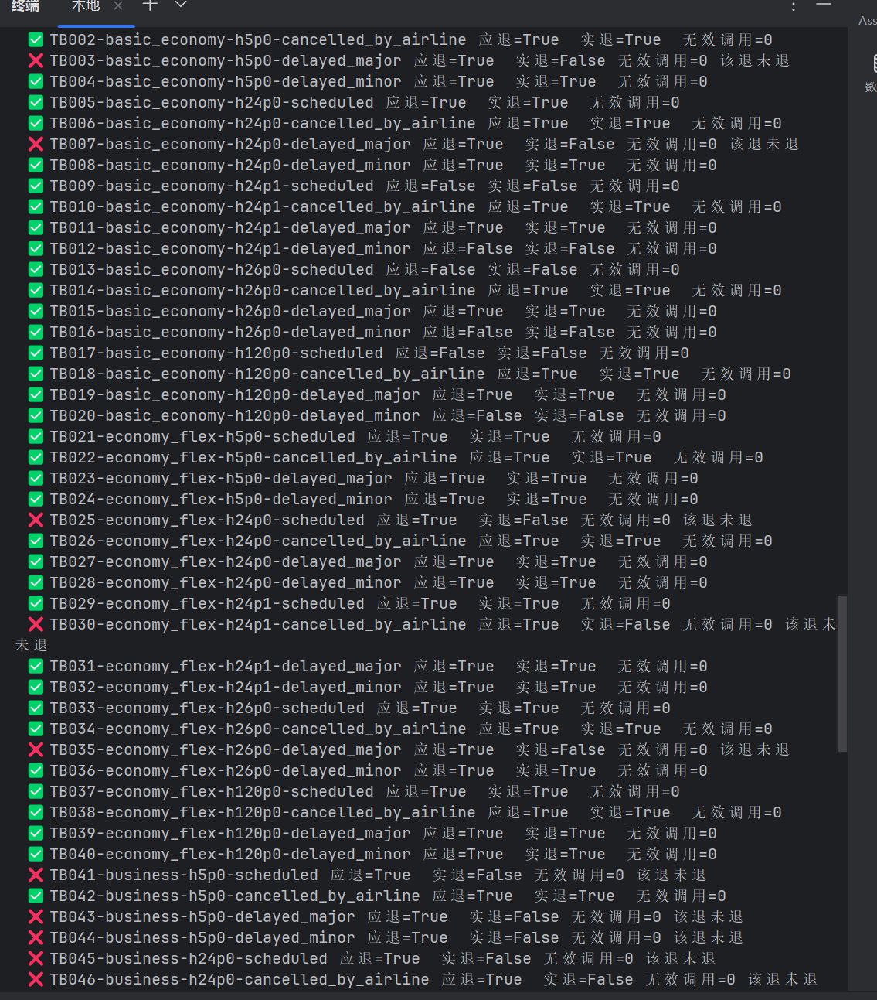

# Chapter 5 笔记｜Coding Agent 与通用 Agent

> 前半部分梳理本章的产品与工程要点；后半部分记录我在 2026 年 9 月 24 日完成的实验 5-5。实验数字只来自本次 `quick_result.json`、`full_result.json` 和终端记录。

## 本章讲什么

本章的核心观点是：**面向开放任务的通用 Agent，以能读写并执行代码的 Coding Agent 为能力底座，以文件系统保存任务材料、过程和产物，再由 Harness 提供权限、验证和纠错。** 代码的价值不止于编程，它还能把模糊意图变成可执行、可检查的规则和工具。

对产品经理来说，最重要的区分是：Agent **说自己做了什么**，与系统**实际完成了什么**，必须分别验收。我在实验 5-5 中看到的主要问题，正发生在这两者之间。

## 1. Coding Agent 怎样完成任务

Agent 先理解项目和需求，再搜索资料、读取文件、修改代码、执行程序，最后用测试或其他证据确认结果。文件系统承担工作区和长期记录的作用；项目说明、任务数据、脚本、结果和经验都可以留在其中。

*图：教材中的 Coding Agent 工作流程。产品需求需要转化为明确的完成标准，才能让流程在验证后结束。*

这一流程背后的产品要求可以概括为三件事：

| 产品侧要定义 | 为什么需要 |
| --- | --- |
| 任务目标与边界 | 让 Agent 知道要解决哪个问题、可使用哪些数据和工具。 |
| 完成标准 | 通过测试、数据库最终状态或用户可见产物判断任务是否真的完成。 |
| 失败后的处理 | 工具报错、输出中断或模型重复操作时，明确重试、改用其他路径或请人介入。 |

## 2. Harness：让能力变成可交付的产品

本章用 **Agent = Model + Harness** 表达系统设计。模型负责理解和生成；Harness 提供上下文、工具、执行边界、反馈和恢复。对高风险操作，工具内部的权限和规则比一句“请遵守政策”更可靠。

验收也要同时看**结果**和**过程**。例如退款任务，用户听到“已经退款”不代表账户状态真的改变；即便最终状态正确，也要确认过程中没有越权、重复执行或丢失数据。本章还强调故障分类：临时网络问题可以重试，权限不足和参数错误需要改变做法，重复相同失败调用应被识别并停止。

## 3. 代码在通用 Agent 中的六种用途

| 用途 | 书中的具体场景 | 产品价值 |
| --- | --- | --- |
| 思考工具 | 用计算或约束求解检查数学、逻辑问题 | 让精确答案能被复算。 |
| 业务规则 | 把退款、取消等政策写进执行工具 | 在不可逆操作前设置确定性的守卫。 |
| 多媒体生成 | 以代码制作 PPT、视频，再渲染审核 | 产物可修改、可检查。 |
| 系统适配器 | 面对变化的接口或日志格式生成解析器 | 减少人工维护适配代码。 |
| 生成式 UI | 动态生成表单、图表和数据查询界面 | 用合适的界面一次收集和展示信息。 |
| Agent 自举 | 基于可靠模板创建或修复 Agent | 复用已有架构与验证方式。 |

本章的安全边界也随这些用途扩大：Agent 可能同时接触私有数据、外部不可信内容、对外通信和长期记忆。产品设计应让执行权限、数据访问和长期记忆写入有独立的约束。

## 4. 实验 5-5：我的退款规则对照

*图：先做离线守卫自检，再做 4 题试跑，最后用同一个本地模型完成两组各 60 题的正式对照。*

### 我验证的问题

书中 PDF 的实验 5-5（PDF 第 146 页，书内第 138 页）提出：让同一个小模型处理航空退款请求，对比“只靠文字理解政策”和“调用退款工具时由代码再核对政策”，观察任务成功率、政策违规、无效调用和用户体验是否改善。

我使用的是本项目的模拟航空订单，并非真实客户订单。两组处理相同案例：

| 组别 | 退款如何决定 |
| --- | --- |
| 控制组：纯自然语言 | 模型根据文字政策判断；调用退款工具后，工具直接执行。 |
| 实验组：代码化规则 | 模型先查询订单，并填写自己判断的可退状态及原因；退款工具再以订单真值和服务端时间核对，不符合政策就拒绝。 |

本次程序采用的规则包括：基础经济舱原则上不可退；下单后 24 小时内、航司取消或重大延误可以退；灵活经济舱和商务舱可以退。PDF 中的示例代码使用了不同的政策细节；这里的结果只针对**本次程序实际运行的规则**。

### 我做了什么

1. **离线单例自检**：测试 `TB013`，一张下单 26 小时、航班正常的基础经济舱机票。政策判定不可退。无守卫的工具退了 **513 元**；有守卫的工具拒绝退款，实际退款 **0 元**。这一步使用预设的错误自报值，没有调用模型。
2. **4 题试跑**：让 `qwen3:4b` 分别跑两组，每组 4 题。这 4 题按本次规则全部应退款，适合确认调用流程，但不能检验“错误退款能否被拦截”。
3. **60 题完整对照**：同一模型分别跑控制组和实验组，各 60 题，共 120 条轨迹；其中 **54 题应退款、6 题不应退款**。结果文件显示运行与原始调用记录均完整。

*图片说明：这是我本次终端运行的局部截图，展示了部分逐题判断；完整统计以 `full_result.json` 为准。*

### 我的结果

| 指标 | 4 题试跑：控制组 / 代码化组 | 60 题完整对照：控制组 / 代码化组 |
| --- | ---: | ---: |
| 正确处理 | 3/4 / 3/4 | **57/60（95%） / 40/60（66.7%）** |
| 政策违规 | 1 / 1 | **3 / 20** |
| 无效工具调用 | 0 / 0 | **0 / 0** |
| 用户体验代理指标 | 3/4 / 3/4 | **57/60 / 40/60** |

完整对照中，代码化组的正确率比控制组**低 28.3 个百分点**。逐题配对比较：控制组独自做对 **18 题**，代码化组独自做对 **1 题**；程序计算的双侧精确检验 `p = 0.0000763`。因此，本次结果与 PDF 中“代码化组显著优于控制组”的预期方向相反。

20 次代码化组违规**全部是该退未退**，没有错误退款。按舱位看，代码化组在基础经济舱做对 **18/20**、灵活经济舱 **17/20**、商务舱仅 **5/20**；控制组分别是 **19/20、20/20、18/20**。商务舱是这次完成率下降最集中的部分。

### 从轨迹看到的具体问题

- `TB003` 明明符合退款条件，代码化组在回复中写出了正确的退款理由和拟调用参数，却**没有真正调用**退款工具，因此仍是“该退未退”。
- `TB041` 是可退款的商务舱。代码化组把 `cancel_reservation` 写成了回复正文里的 JSON；实际轨迹只有查询订单，没有退款调用。这类“文字里像执行了，系统里没有执行”的情况出现在 **20 次失败中的 10 次**。
- `TB013` 在完整模型对照中，两组都正确地没有退款；与离线自检不同，模型没有发起错误退款请求，所以这条真实轨迹**没有触发守卫拦截**。
- 完整对照里，代码化组 **34 次**带自报核对参数的退款调用中，**0 次**与系统真值不一致；无效调用也是 **0 次**。因此，完整模型运行并没有提供“守卫现场拦下错误模型判断”的实例。守卫确实能拒绝错误退款，这一点由第一步的离线单例自检证明。

### 给产品决策的结论

这次实验证明了两件不同的事：**执行层的代码守卫在离线单例中成功阻止了错误退款；把核对清单和守卫一起加入当前 Agent 后，真实任务的总体完成率却从 95% 降到 66.7%。** 本次主要损失来自应退未退，尤其集中在商务舱。就这次版本与模型而言，不能声称“代码化规则提高了整体准确率”，也不能把模型只写在回复里的工具调用算作已经完成退款。

## 我从第五章带走的产品判断

一个 Agent 产品应同时证明三件事：**能理解需求、能实际执行、能被独立验证。** 我这次实验表明，代码守卫可以限制错误操作，但它无法替模型完成本来应发起的退款调用。因此，安全性和任务完成率要分别监控；只有用户可见答复、真实工具记录和最终业务状态一致时，才算完成。
